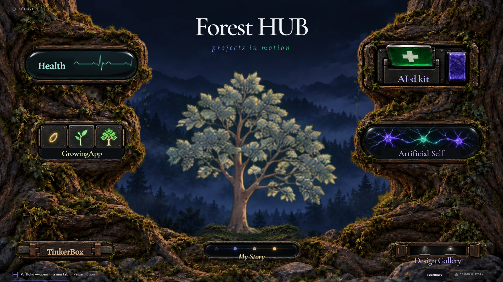

# Approved pool-motion pass — 2026-09-24

Current follow-up: [fixed plate and readable instruments](frontpage-refinement-2026-09-24.md).
The earlier synthetic-grass, moving-bark and small ECG-lobe descriptions are historical.

Latest instrument behaviour: [local motion and depth pass](frontpage-pool-polish-2026-09-24.md).
In particular, Health now goes flat only during a momentary press, not while selected.

Historical receipt for merged #626. The [approved correction](frontpage-correction-2026-09-24.md)
supersedes its scrolling ECG, decorative-only vines, ground treatment and phone
thumbnail layout. Keep this record as evidence of that earlier pass, not the
current interaction specification.

Source: Ivan's approved behavior table in the task, following the asset-layer
delivery. Branch starts at c19d84e (main); #619 is already merged. This is an
implementation pass, not a new composition or tree asset.

## Contract and task ledger

- [x] 1. Failing behavior tests for heartbeat/flatline, traveling neural impulses,
  mechanical selection, grounding and complete pause/reduced-motion.
- [x] 2. Seven differentiated idle/focus/hover/press responses using the existing
  clock. A deliberate second activation retains the existing navigation behavior.
- [x] 3. Join the moss island to the foreground; original native grass and vines,
  no borrowed CodePen code, images, or scene.
- [x] 4. Source and built-page browser tests, desktop/mobile visual evidence,
  four-times CPU-throttled phone-profile frame cost.
- Delivery gate: commit/push and follow-up PR against main; independent Sail
  review pinned to that final head. Receipt belongs on the PR so recording it
  does not invalidate its own reviewed commit. No merge or self-approval.

Tree box remains desktop 50vw/54vh, 58vh high, width 58vh*226/214; portrait
50vw/28vh, width min(68vw,32vh). Existing landscape exception remains. No JS
tree transform/top/size writes. Pure seek() and DOM-index arrival order remain.
No routes, pool pages, ranks, tiers, validation or story copy are changed.

Pre-flight: the mechanism and environment share the existing resolve controller's
elapsed time. Fast local signals need a faster sampling cadence than the old
900ms wind cadence, not a second scheduler. Only transform/opacity change in the
effect loop; geometry is measured on setup/resize, not each frame. Pausing,
reduced-motion, hidden tabs and offscreen state must stop ongoing effects.

Baseline: npm test has the known pre-existing Windows CRLF source-integrity
failure in `AI-d kit subpages are published from observed boundaries`
(008ceb versus c7d630). It is not part of this change and remains untouched.

## Approved behavior

Health: regular heartbeat, faster regular hover/focus beat, flatline and physical
depression on selection. Artificial Self: sparse traveling electrical impulses,
faster branching activity on hover/focus, convergent discharge on selection.
AI-d kit: hinged paddle and flipping flag. GrowingApp: seed/sapling/tree sequence.
TinkerBox: staggered pins and releasing compartment. Design Gallery: subtle
exhibit lighting and shutter reveal, without growing its footprint. My Story:
faint-to-bright signal with stronger final-node response, no added copy.

Preserve the existing two-step entry and Escape cancellation. No new narrative.
The thumbnail cannot gain detail through CSS: its replacement remains Ivan's
high-resolution render, not a procedurally invented tree in this pass.

## Actual mechanisms and layer hand-off

| Pool | Rest / engagement / selection |
|---|---|
| Health | Continuous 72 bpm trace; hover or keyboard focus eases to 135 bpm; selection hides the trace, shows a flatline and depresses the instrument. Escape restores the trace. |
| Artificial Self | Seven sparse impulses follow cubic paths over the retained painted neurons. Hover/focus speeds the same continuous phase, with brighter/longer traveling impulses. Selection reverses the outer impulses toward the cores and illuminates the cores. No rectangular brightening crop. |
| AI-d kit | The purple paddle hinges from its top and sinks; its first-aid flag rotates through 180 degrees into its latched state. A dark socket remains behind each removed crop. |
| GrowingApp | Three existing seed/sapling/tree inserts lift and brighten in succession; engagement speeds the succession without jumping its phase; selection depresses the whole instrument. |
| TinkerBox | Left pin withdraws first, right pin follows, then a separately cropped lid tips open. The lid uses the original texture; nothing is redrawn. |
| Design Gallery | Quiet exhibit light gains weight, and the two original shutter crops turn outwards on engagement/selection. No enlargement of the entry. |
| My Story | Four existing positions remain progressively stronger; an independent signal travels between them. Engagement quickens it; selection reinforces the last node. No content was added. |

Every whole-entry click still selects first. A second deliberate activation opens
the existing native link; a double-click does not skip selection. Enter and Escape
remain usable. Reduced motion changes selection immediately but runs no motion.

New editable sources are code-native SVG for the ECG, neural wires, soil, two
vines and four grass groups (36 blades), plus independent HTML impulse/glow
layers. `scratch/frontpage-motion-proof.cjs` exports the SVG planes and their
runtime/CSS into a `native-layers` supplement; it also records the actual page.
This supplements, not replaces, the earlier 11904ba raster-layer package in Drive.
The first-aid mechanism, growing inserts, shutters and compartment texture still
use that exact approved raster artwork. No new tree detail is claimed.

The soil texture is the existing ground asset, placed behind the trunk and
feathered into the foreground. Grass groups share the original wind field and
their existing near/far lag. The two original SVG vines respond to that wind and
the same restrained pointer parallax as the distant background. No code or scene
elements were copied from the reference CodePen. The technique attribution in
`frontpage-resolve.md` still applies.

## Cost and scheduling

Only the existing resolve controller requests animation frames. The local effects
receive its elapsed seconds; they have no timers or independent scheduler.
Idle instruments sample at 15 Hz, engaged ones at 30 Hz, and mechanical easing
runs at the display cadence for its 0.36-second response. Slow wind/air remain at
900 ms samples. Offscreen pools do not write effects; visible phone pools keep
working even when the tree is scrolled offscreen. When the entire scene leaves
view, the clock stops. Hidden documents, Pause, zero strength and reduced motion
also stop ongoing motion. Geometry reads occur only at setup/resize.

The initial version was rejected at 1.777 ms per 60 Hz frame in an instrumented
4x-CPU phone proxy, including repeated SVG layout. Moving animated heads to HTML,
retaining static SVG paths, containing instruments, culling offscreen pools and
deduplicating/rounding style writes removed those layouts and paints. Slow
environment updates were separated from the instrument sampling cadence, not
given another clock.

Final uninstrumented paired runs: BUTCHER / Brave Chromium, 390x844, DPR 2,
4x CPU throttle; 10 seconds each, preview paused and no concurrent browser test.
Baseline is the actual merged workbench at `c19d84e`, not the older pre-workbench
scene used by the historical ambient benchmark.

| Run | Merged baseline ms/frame | Motion pass ms/frame | Additional cost |
|---|---:|---:|---:|
| 1 | 0.4672 | 1.0140 | 0.5468 ms / 3.28% of 16.67 ms |
| 2 | 0.4392 | 1.0455 | 0.6063 ms / 3.64% |
| Paused | — | 0.0042 | Zero script, layouts and style recalculations |

The full moving scene is **6.08–6.27%** of the emulated 60 Hz main-thread budget;
the added motion is **3.28–3.64%**. This does not satisfy a stricter interpretation
of “a few percent” meaning the entire scene below 3%; it is not rounded into one.
The separate trace gives callback p95 0.60 ms, 601 callbacks / 10 seconds,
139–146 intended draws, **0 layout, 0 paint and 0 reported dropped-frame events**.
Paused trace: **0 callbacks/draws/layouts/paints**. This is a CPU proxy, not a
physical-phone GPU, thermal or battery claim. Raw summaries accompany the proof.

## Scope checks

Compared with `c19d84e`, every `.resolve-tree` CSS rule and the whole `seek()` body
are byte-identical after newline normalization. The runtime still writes only
filter to the tree. No route/file deletion or rename; no pool page, rank, tier,
registry, validator, catalog string or narrative change. No migration or deploy.

The browser regression lane grew from 34 to 42 cases. New tests were observed
failing for missing ECG/neural/soil behaviors, the absent compartment lid and
the non-flipping flag. The phone regression caught the old tree-only visibility
gate; its sampling window includes the legitimate refractory interval between
sparse impulses. All earlier tests remain, with the offscreen case now scrolling
the entire scene out of view instead of treating a visible pool as offscreen.

## Verified result

- Source browser lane: **42/42**. Fresh built output: **42/42**.
- Built foundation contracts: **6/6**.
- General source suite: **191/192**, unchanged known CRLF failure only:
  `scratch/tests/ai-kit-offers.test.js:38`, 008ceb versus c7d630. Not modified.
- Eight added browser regressions; none removed or skipped. Local Node 26.3.0;
  the repository's Node 22 engine declaration is unchanged.
- Manual Brave use: Health's first press flattened the trace and stayed on the
  page; Escape restored it. A 390x844 viewport retained the readable dense
  directory; AI-d kit pressed without immediately navigating. No console errors.
- The saved recording exercises hover, selection and cancellation for all seven
  controls. Desktop and phone selected-state screenshots were captured for each.
- No migrations, production deployment or route changes.

| Viewport | Full entries in view | Tree box x / y / width / height (px) |
|---|---:|---|
| 1920x1080 | 7/7 | 629.242 / 269.992 / 661.516 / 626.391 |
| 1366x768 | 7/7 | 447.797 / 192 / 470.406 / 445.438 |
| 390x844 | 5/7, remaining two scroll normally | 62.406 / 110.758 / 265.188 / 251.109 |
| 320x568 | 3/7, normal continuation | 69.125 / 72.984 / 181.75 / 172.094 |
| 780x390 | 1/7, normal continuation | 327.602 / 96.914 / 124.797 / 118.172 |

[Rendered motion recording](https://drive.google.com/file/d/1rMoHzMFe0841et4vvLzX2eFCzMr3C7D-/view)
is 4,785,974 bytes, verified by Drive metadata readback in the existing animation
layer folder. It is an actual browser recording, not a mockup or a second
animation implementation. [Desktop](frontpage-motion-proof/opened-desktop.png),
[phone continuation](frontpage-motion-proof/opened-phone-full.png),
[paired cost data](frontpage-motion-proof/cost-summary.json), and
[separate trace summary](frontpage-motion-proof/trace-summary.json) are in git.

